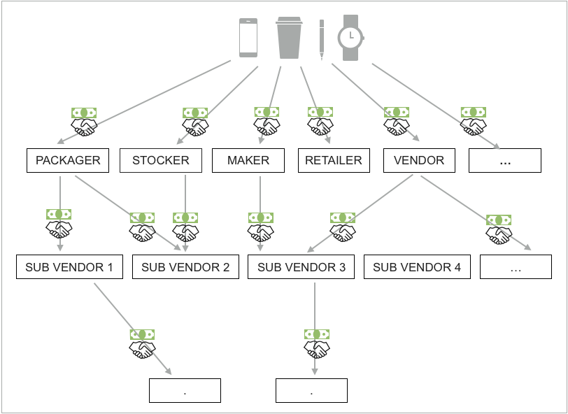
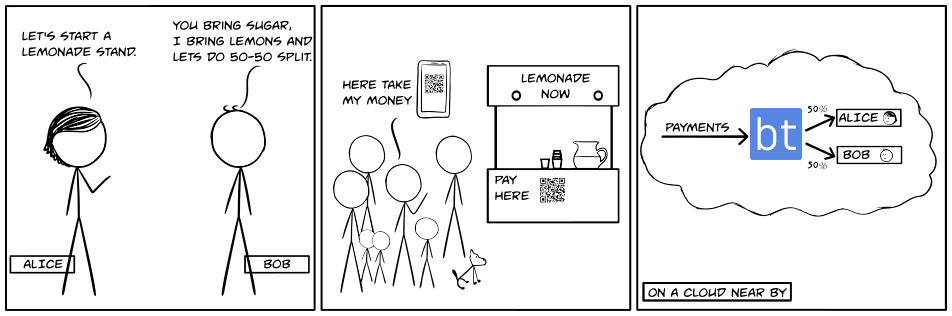
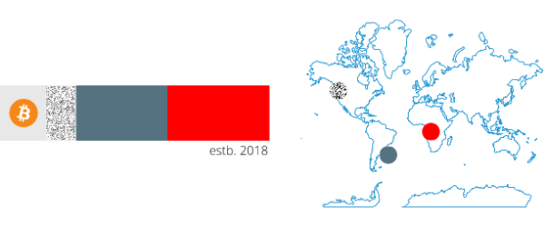

<p align="center">
  
</p>

<h1 align="center">白皮书</h1>

<p align="center">
  <a href="https://blockterms.com"><h3>blockterms: 数字货币的集体结构</h3></a>
</p>

Author: Anil Kumar <a href="mailto:yak@fastmail.com">yak@fastmail.com</a>

<p align="center">
  <a href="https://github.com/blockterms/whitepaper/releases">
    
  </a>
</p>

## 目录

- [术语](#术语)
    - [数字资产](#数字资产)
    - [区域链](#区域链)
    - [分布式分类帐技术](#分布式分类帐技术)
- [介绍](#介绍)
- [背景](#背景)
- [问题领域](#问题领域)
- [解决方案](#解决方案)
- [它是怎样工作的?](#它是怎样工作的?)
- [blockterms合作伙伴](#blockterms合作伙伴)
    - [合作伙伴的通常类型](#合作伙伴的通常类型)
    - [合作伙伴的地址](#合作伙伴的地址)
    - [合作伙伴的结构](#合作伙伴的结构)
        - [代币和所有权结构](#代币和所有权结构)
    - [结算算法](#结算算法)
    - [交易属性](#交易属性)
    - [合作伙伴地址的所有权](#合作伙伴地址的所有权)
    - [交易频率](#交易频率)
    - [小金额的积累](#小金额的积累)
- [所有权的透明度](#所有权的透明度)
- [合作经济](#合作经济)
- [真实世界案例](#真实世界案例)
    - [在线预订](#在线预订)
    - [房地产](#房地产)
    - [住房贷款和储蓄账户](#住房贷款和储蓄账户)
    - [技能小团队](#技能小团队)
    - [基础设施](#基础设施)
    - [教育](#教育)
    - [现代科技服务](#现代科技服务)
    - [ICO的股息](#ICO的股息)
- [结语](#结语)
- [引用](#引用)

## 术语

#### 数字资产

“数字资产”也称为“加密硬币”，“加密令牌”，“加密货币”，“虚拟货币”或“数字货币”。这些资产中的大多数都基于计算机网络的加密协议，该协议可以是集中式或分散式的，封闭的或开源的。

在本文中，数字资产代表用作交换媒介和/或价值存储的资产。

数字资产的流行例子是比特币，以太，miota，neo和**瑞波币。截至2018年，已有1300多种已知的加密货币。这些货币发行的所有资产均被视为数字资产。

本白皮书中使用的概念可以轻松应用于美元，人民币或日元等国家货币，用于在线支付。交易费用和处理传统货币的规定可能过于昂贵。

>https://en.wikipedia.org/wiki/List_of_cryptocurrencies

#### 区域链

From [wikipedia](https://en.wikipedia.org/wiki/Blockchain).

区块链是一个不断增长的记录列表，称为块，使用加密技术进行链接和保护。每个块通常包含前一个块的**加密散列，时间戳和事务数据。通过设计，区块链固有地抵抗数据的修改。它是“一种开放的，分布式的分类账，能够以可验证和永久的方式有效地记录双方之间的交易”。为了用作分布式分类账，区块链通常由对等网络管理，该对等网络共同遵守用于验证新块的协议。一旦记录，任何给定块中的数据不能追溯地改变而不改变所有后续块，这需要多数网络合作。

区块链是安全的设计。


#### 分布式分类帐技术

分布式分类帐技术或（DLT）是用于记录资产交易的数字系统。这些交易的详细信息同时记录在地理上分布的多个位置。分布式分类帐没有中央数据存储或控制数据存储内容的中央权限。区块链是分布式账本技术的一种实现。

## 介绍

**blockterms: Collective Structures for Digital Currency**

通过blockterms,多方可以形成数字货币支付地址，并可以为如何以及多久在该支付地址结算资金的定义所有权结构。消费者以支付地址支付货物和服务的交换，并且所有权结构中涉及的所有各方在交易或交易中获得适当的价值份额。

1. 司机得到70％，AirLift获得30％的消费者支付交易。
2. 如果是深夜，司机应该多奖励10％。
3. 如果驾驶员声誉良好，AirLift希望以每次乘坐多达1000美元的额外固定费用奖励驾驶员。

如您所见，这些术语可能非常简单并且可能变得非常复杂。

上述合作伙伴示例中有两个重要部分。

1.所有权结构。
2.结算算法。

所有权结构根据商定的条款和条件确定参与者及其在进入交易中的价值份额。所有权结构可以是公共的或私有的，可以私下存储，也可以存储在公共/私人分布式账本中。

结算算法执行条款并确保合作伙伴分享合作伙伴关系。
结算算法可以是开源的或封闭的。

总之，blockterms是一种基于数字加密货币（如比特币）的无信任结算层。

## 背景



**Fig.1**

不同的实体彼此形成协作财务关系，以将产品或服务推向市场。这种组织我们商业的模式产生了我们在日常生活中使用的一些最伟大的发明。

要了解这种合作的规模及其有效性，请观看一位著名经济学家的视频，该经济学家描述了这种自愿无许可合作如何为全世界这么多人带来繁荣。

更长的版本 [Prof Milton Friedman - Lesson of the Pencil](https://www.youtube.com/watch?v=4ERbC7JyCfU)

更短的版本 [Prof Milton Friedman - Lesson of the Pencil](https://www.youtube.com/watch?v=67tHtpac5ws)

文字参考 [I, Pencil: My Family Tree as told to Leonard E. Read]

在这种贸易和商业模式中，个人只有通过为他人增加有意义的价值才能积累财富。最近越来越多的人感到被排除在这种繁荣的体系之外。这种感觉可能是暂时的，可能是2008年金融危机的直接影响。

展望未来，如果为了生产目的而组织人类活动的这种模式要继续运作良好，那么它应该包含一个透明和公平感知的元素。

金融合作的模式不仅应该是公平的，而且在生理层面，人们应该认为它是公平的。

这里提到了生物学层面的公平观念。

更长的版本 [Dr Frans de Waal - Moral behavior in animals](https://www.ted.com/talks/frans_de_waal_do_animals_have_morals)

更短的版本 [Dr Frans de Waal - Moral behavior in animals](https://www.youtube.com/watch?v=meiU6TxysCg)

文字参考[猴子拒绝不平等支付]

## 问题领域

跨越地理边界的这种规模的合作在很多方面都具有挑战性。

当消费者为产品或服务付费时，他们不知道他们的钱最终会去哪里。有关谁拥有此产品，该产品如何产生以及消费者支付的金额等等的信息与产品的价格或销售无关。消费者轻松获得此类信息对于鼓励进行财务规划安排的企业的普遍道德标准非常重要。

对公平的认识推动了消费者的行为。当人们听到偏远战争国家的恶劣工作条件或发展中国家的童工时，它会促使他们选择符合其公平感的替代选择。一些例子是关于血钻的规定，服装厂的恶劣工作条件和道德采购食品。

在如图1所示的产品或服务的完整合作树中，有太多的金融中介来促进这种合作规模。金融中介机构提供有用的服务来培育财务安排，但价值转移的交易费用很高，影响了市场上的产品价格。

结算不及时。在计算销售后，从一个实体到另一个实体的现金流量在一端完成。这使得某些实体处于不对称的财务关系中，容易产生道德风险。这是一个负担与个体产生轻松的财务关系，就像一个 blockterms尝试去解决不可信的结算系统.

## 解决方案


在本文中，我将介绍blockterms如何结合三种通用技术，并创建一个价值网络，为现有的商业模式带来新的透明度。

三种通用技术是
1.通用的通信方式，即互联网
2.普遍的价值衡量标准，即数字货币
3.通用计算机，即区块链

blockterms提出了三个特征。
1.blockterms与所有权结构的伙伴关系
2.不信任的解决方案
3.所有权透明度

blockterms合伙企业是多个实体之间的财务安排，具有明确的份额，即每个合伙人从交易价值中获得多少。

无信任结算是一种在合作伙伴之间将金融交易中的价值分割的自动化方式。

通过为合作伙伴建立一个独特的网页并将所有权结构中的合作伙伴地址与其他合作伙伴关系及其在互联网上的网页上的信息联系起来，从而提供所有权透明度。

## 它是怎样工作的？

它分三步进行
1.选择货币，选择区块链并在每笔交易中设置每个合作伙伴的价值所有权份额。这将创建一个独特的数字资产地址，并为此合作伙伴提供独特的网页。
2.将此付款地址集成到产品或服务中以及您的付款服务提供商并接受付款。
3. blockterms为伙伴关系地址所有权结构中的每个合作伙伴积累了微量的价值，并在所有合作伙伴之间结算资金。

## blockterms合作伙伴

blockterms合作伙伴是一种基于交易和所有权结构的财务安排。每个交易定义所有权结构。

blockterms合作伙伴的两个可实现的目标是

1.使用智能手机创建和管理这个概念应该很容易。这个模型可以用柠檬水贸易的样本概念向高中学生团队解释。

2. 合作伙伴之间的资金结算应该是自动化的。



## 合作伙伴的通常类型

#### 合作伙伴每笔交易的固定费用

每笔交易支付固定费用。如果交易中的价值高于固定费用，则忽略固定费用

|参数|描述|
|:----|:----|
|费用|每笔交易付给合作伙伴的固定费用.|


#### 每笔交易合作伙伴固定费用的上限

每笔交易向合作伙伴支付固定费用，每天或每周或每月设置最大上限等或总体上限。

|参数|描述|
|:----|:----|
|费用|每笔交易支付固定费用。|
|时间限制|取决于时间频率。如果支付给该合作伙伴的总固定费用在time_frequency*持续时间内达到此限制。在及时的剩余时间内不会支付固定费用。|
|时间频率|每日，每周，每月，每N天|
|最大限额|这是将转移给此合作伙伴的总最高金额。在那之后，伙伴关系结束了。|

#### 每笔交易合作伙伴的百分比

交易金额的一定百分比将支付给合作伙伴。所有百分比的总和应该加起来100％。

|参数|描述|
|:----|:----|
|百分比|交易金额的一定百分比将支付给合作伙伴。|

#### 每笔交易合作伙伴的百分比的上限

交易的百分比是按每笔交易的合作伙伴支付的，每天或每周或每月设置最大上限等。

|参数|描述|
|:----|:----|
|百分笔|交易金额的一定百分比将支付给合作伙伴。|
|时间限制|取决于及时的频率。如果支付给此合作伙伴的总金额在time_frequency持续时间内达到此限制。在及时的持续时间内，不会再转移任何金额。|
|时间频率|每日，每周，每月，每N天|
|最大限额|这是将转移给此合作伙伴的总最高金额。在那之后，伙伴关系结束了。|

一旦此百分比合作伙伴关系结束，其他百分比合作伙伴或此资金的比例增加将收集到特定地址。

#### 合作伙伴时间变化固定费用

在时变固定费用合伙企业中，费用根据简单/复利率增加或减少。这种伙伴关系可以有及时的限制或总体限制。
在达到超过所有限制的伙伴关系结束的时间段内，在达到上限之后，及时限制停止。

这种伙伴关系是为短期项目筹集投资或资金的良好候选人。

#### 合作伙伴时间变化百分比

与上面类似。合作伙伴获得一定比例的交易而不是固定费用。

#### 运营时合作伙伴

运行时伙伴关系取决于事务属性中每个事务中可用的运行时信息。结算算法解析事务属性，以便对每个伙伴的所有权份额进行动态决策。

#### 复杂的伙伴关系

复杂的合作关系取决于外部数据，如合作伙伴在结算期间的表现。


### 伙伴关系地址

为给定货币生成伙伴关系地址。可以获取公共合作伙伴地址的可视化表示到url。

> https://blockterms.com/partnership/[address].svg?size="small|medium|large"


具有固定费用和百分比合伙关系的样本地址的直观表示如下所示。


比特币是这种伙伴关系的交换货币。虚线区域表示固定费用，每种颜色代表不同的合作伙伴及其百分比所有权。 estb 2018表明这种伙伴关系是自2018年以来在区块链上建立的

该图像视觉可以链接到该合作伙伴地址提供的产品或服务的不同营销材料。

公共合作伙伴地址有自己独特的网页地址，可以获得有关财务安排及其版本历史的信息。如果合作伙伴关系与其他合作伙伴地址有关系，则这些合作伙伴地址显示为指向其自身网页的链接，从而代表有价值的网络可以将整个伙伴关系结构可视化为具有节点和边的图。节点表示伙伴地址，边表示节点之间的财务关系

### 所有权结构

合伙企业的所有权结构可以从简单到复杂。对于公共合作伙伴关系，此信息存储在公共区块链中。当前参考实现使用NEO。

数据存储在区块链上，用于简单的合作伙伴关系

```
1. 接受付款的地址
2. 合同货币
3. 固定费用结构 addr：val，addr：val ......
4. 合作伙伴结构 addr：val，addr：val ......
5. 地址结构 addr：location，addr：location ....
6. 网站地址，用户可以在其中找到更多信息
```

根据底层区块链功能，数据格式可能略有不同。数据应该可以很容易地序列化为json或xml。这种格式的一致性和标准化对于使区块链上的区块信息与分布式账本技术空间中的其他新兴系统可互操作非常重要。

对于稍微复杂的所有权结构，数据结构也将条件语句作为参数。

对于动态运行时伙伴关系，python函数可以在运行时生成所有权结构

#### 代币和所有权结构

对于具有实用的代币的网络或系统，您可以从每个地址拥有的代币共享中自动获得所有权结构。使用blockterms，您可以使用此所有权结构创建一个合作伙伴地址，并为所有所有者分配股息。

### 结算算法

每个伙伴关系地址与执行伙伴关系条款的结算算法配对。

应该可以为大多数常见用例标准化结算算法，并允许高级用户为特殊情况定义特定算法。

结算算法可以是开源的，也可以是私有的，简单的或复杂的。

结算是零和活动。所有收到的资金都有100％的目的地

更简单的结算系统依赖于更少的参数，并且结算系统所依赖的数据量决定了其复杂性。

更简单的系统的一些例子是：

* 图书作者与网站/移动应用程序合作，以固定费用为基础的合作伙伴关系出售他们的新书。
这也适用于在网站/电视媒体上推广的其他类型的产品，如游戏，应用，电影，制成品。
* 小型投资者可以与艺术家/工匠合作，提前进行一些投资，以换取创造性工作销售的时间百分比合作伙伴关系。
* 由贯穿各领域的小团队合作。例如，一群技术熟练的专业人员可以就他们一起做的小项目（例如纪录片工作人员或志愿者医疗团队或短期广告活动家等）达成百分比条款

在所有这些情况下，合作条款相对简单，并且依赖于较少的参数。如果合伙人地址中有资金，则帐户将根据预先确定的条款结算

在某些其他情况下，运行时参数作为事务的一部分使用事务属性中的事务中的额外信息发送。额外信息可以是简单的名称值对，如cookie或http参数。

在现实世界场景的某些复杂用例中，不是在结算算法附近移动数据，而是将结算算法移动到数据附近会容易得多。

这种复杂系统的一些例子是

* 如何在获胜的足球队成员之间公平分配资金？
* 如何在开源软件/硬件/设计项目的贡献成员之间公平分配资金？
* 如何根据已停销的门票数量在支持团队中公平分配资金？
* 如何根据社交网络社区成员的消息传播活动范围公平分配资金？

在上述所有情况中，可能很难就什么是公平达成协议。收集的数据量和数据对结算环境的重要性决定了可实施的结算系统的复杂性和可行性。


### 交易属性

交易属性可以与支付交易一起发送。结算算法使用此额外信息来执行需要上下文数据来做出决策的伙伴关系条款。
交易属性将是阻塞或分布式分类帐的一部分。 不希望此信息公开的客户端可以使用共享密钥发送加密的事务属性。

ECDH允许双方各自拥有自己的私钥和公钥对，可以生成公共共享密钥，以便能够发送和接收加密消息。

付款发件人通过将公钥传递到合作伙伴地址端点并获取共享密钥来进行api呼叫。在双方之间使用此共享密钥发送的消息只能由这两方解密。

>https://en.wikipedia.org/wiki/Elliptic-curve_Diffie%E2%80%93Hellman

### 交易频率

最小值是块级别。每次为货币创建新块时，将检查该块以查找合作伙伴地址并确定交易。

另一端是手动的。资金累积，直到合伙人有效编辑的人手动要求结算资金。此选项对于在实际转移资金之前预览结算非常有用。

在没有区块的货币中，可能有交易级别结算。

### 小金额的积累

在每次结算之后，如果合作伙伴的份额低于非常小的阈值，则这些金额将在合伙企业地址中累计，并且扣除资金转移，直到其金额加起来超过阈值。结算费用也是如此。

我们将许多小额批量合并为一笔交易。不同货币的门槛值不同。

## 所有权的透明度

消费者可以浏览他们购买的产品或服务的合作伙伴关系结构，看看他们的资金来源以及产品的来源。



## 合作经济

区块链通常被描述为有价值的互联网。 Blockterms利用区块链的潜力来实现数字合作经济。

一组个人地址可以形成伙伴关系地址，一组个人地址和/或伙伴关系地址可以形成其他伙伴关系，从而形成复杂的链式和金字塔式的合作结构，以在市场中提供商品和服务。这类似于形成分子的一组原子和形成其他分子的一组原子和/或分子。

可以使用各种复杂的链和金字塔，其他付款地址内的付款地址等等。所有这些结构都可以使用URL链接到网页中的这些地址。


金字塔在金融中使用是一个坏词，但这些数字摩天大楼使我们能够检查市场上提供的普通商品和服务的定价，并调试哪些组件可以被改进以降低价格并且制造价格高效的经济模块。


## 合伙地址的所有权

创建伙伴关系地址时候会生成并且创建edittoken. edittoken可选择链接到邮箱地址. 如果用户忘记edittoken，重置edittoken的链接将发送到电子邮件地址。

谁曾拥有edittoken，拥有编辑合作关系的权限。伙伴关系地址的关键由blockterms拥有。这些密钥仅用于离线签署交易并提交给货币网络。

有可能建立一个多签名系统，其中多个合作伙伴必须签字以对伙伴关系信息进行更改。这将消除对edittokens的需求。社区采用推动了这种定制功能需求.

## 真实世界案例

### 在线预订

酒店所有者和在线预订公司可以通过blockterms相互合作，并且当消费者支付预订费用时，可以近乎实时地结算资金。

### 房地产

一小群投资者为房地产项目提供资金，并使用blockterms创建所有权结构。他们以每月租金的形式从项目中获得退货。

### 住房贷款和储蓄账户
目前的购房模式涉及到一个值得信赖的集中管理机构，如银行，并以每月支付的形式，以适度的利率寻求以X年为单位支付的贷款。银行从其他储户那里存款，他们将钱存入银行以换取较小的回报率。在这个模型中，储户的钱通过中间人即银行进入房屋贷款。尽管储户并没有直接从他们的储蓄存入银行的钱中发生的经济活动中获益，但这种模式运作良好很长时间。

区块链允许改进此模型。来自未来购房者的房屋贷款可以分解为10,000件所有权，每个人拥有一小部分房屋抵押贷款。 Blockterms可以轻松地形成这样的所有权结构。每个月当房主支付抵押贷款时，封锁会按比例将金额分配给所有权结构。

这种较新的模式可以帮助储蓄者从他们的储蓄中获得更多价值。  

### 技能小团队

一个拥有不同技能的小团队可以在障碍上形成简单的百分比合作关系，并立即开始创造价值。无论何时使用他们的工作或在合作伙伴地址上付款，所有合作伙伴都会立即获得他们的价值份额。

应用程序制造商，游戏开发商，视频制作人，音乐制作人，音乐乐队，纪录片制作人，艺术家，作家，博主，动画师，3D建模师和许多小团队都可以从更简单的协作模式中受益，从而降低结算的复杂性。

### 基础设施

blockterms为基础设施开辟了一种新的本地化融资模式。

从当地社区筹集道路或桥梁的资金，并建立所有权结构。建立桥梁，然后每当有人支付使用基础设施的费用时，所有者就可以通过微交易应计获得回报。

该型号的另一个简单用例是智能停车计时器。智能停车计时器需要多方聚会，例如城市，当地社区，生产和服务机器和消费者的公司。每当消费者使用这台机器时，所有这些合作伙伴都需要获得他们的价值份额。他们的合作条款需要不时进行调整和修订。 blockterms提供了实现它所需的工具。通过加密货币使这种公共 - 私有的社区资源所有权变得容易，而阻塞在其中起着很小的作用。
在任何给定时间，消费者都可以检查合作的整个合作伙伴树，以将此设置带入他们的社区。


### 教育

教师，学校和大学应成为学生未来成功的金融合作伙伴。合伙价值应随着时间的推移而减少，并且每名学生应有适当的最长生命期限。在这个模型中，学校和大学的收入直接来自学生未来的财务成功，这是教育机构提供优质教育和充分利用每个学生而不是为每个人提供通用相同教育的巨大动力。 。

教师退休福利的想法是一个非常困难的主题，但像教学这样的职业也可以是生产性的企业，需要像市场上的任何其他企业一样得到奖励，并且他们投入的努力的回报应该在他们的期间归还给他们。终身包括退休期间。

目前的初等教育融资模式由世界各国政府提供。教育工作者在薪酬和养老金方面的回报并非基于需求和供给的经济因素，这使得很难为这些职业提供公平的模范补偿。

对于高等教育，金融机构让学生从他们的未来中借鉴，但目前公平的教育成本模型很难从数学上推导出来。

blockterms为分散的财务模型提供了一个框架，其中每个学生都有一个单独的区块支付地址，其所有权结构由与学生相关的所有教育者和教育机构组成。当前学生未来薪水的未来收入的一定百分比用于支付所提供的服务。

### 现代科技服务

汽车公司在研发方面投入了大量精力，为消费者带来了最新，最伟大的创新。设计师和工程师花了无数个小时来完善他们的计划和想法，使人们更好，更安全地使用他们制造的汽车。之后，他们进行了大量的金融工程，使他们的发明能够承受更广泛的消费群。如果消费者购买这种现代奇迹，然后用一辆逃走的汽车抢劫一家银行（比喻性地），那么汽车公司就不会减少战利品。这是什么样的公平？

汽车公司通过与依赖汽车开展业务的其他企业进行财务合作，可以从发明中获得更多价值。一个例子是乘坐共享应用程序。

blockterms为汽车公司创建了一个财务模型，可以直接与乘车共享应用程序和驱动程序合作，从而减少每笔交易。这种融资模式有助于驾驶员以较低的资本进入生产型企业，并帮助汽车公司从其创造中获得更多价值。

### ICO的股息

ICO是一种从投资者那里筹集资金以获得商定的所有权的新形式。相同的所有权结构可用于以股息的形式向投资者分配回报。 blockterms使得组织和管理所有权结构变得容易，并随着时间的推移对其进行版本化。

## 结语

最后一个关于一个叫做业力的概念的说明，意思是行动。根据东方的灵性，宇宙做了一个高精度的浮点运算_来跟踪每个人的KARMA，无论是正面的还是负面的，直到它加起来相当大的数量然后出现并以生命事件的形式表现出来。

这是_bGood_变量在这个世界上的一个原因。

这类似于阻止金融交易和通用计算机，即区块链。


## 引用

* Lesson of the Pencil
    * Longer version [Prof Milton Friedman - Lesson of the Pencil](https://www.youtube.com/watch?v=4ERbC7JyCfU)
    * Shorter version [Prof Milton Friedman - Lesson of the Pencil](https://www.youtube.com/watch?v=67tHtpac5ws)
    * Text Reference [I, Pencil: My Family Tree as told to Leonard E. Read]

* Moral behavior in animals
    * Longer version [Dr Frans de Waal - Moral behavior in animals](https://www.ted.com/talks/frans_de_waal_do_animals_have_morals)
    * Shorter version [Dr Frans de Waal - Moral behavior in animals](https://www.youtube.com/watch?v=meiU6TxysCg)
    * Text Reference [Monkeys reject unequal pay]

* Kanye West - Diamonds From Sierra Leone
    * https://genius.com/806432
    * https://www.youtube.com/watch?v=92FCRmggNqQ

* https://en.wikipedia.org/wiki/Elliptic-curve_Diffie%E2%80%93Hellman

* Formalizing and Securing Relationships on Public Networks by Nick Szabo
    * http://firstmonday.org/article/view/548/469

[I, Pencil: My Family Tree as told to Leonard E. Read]: http://www.econlib.org/library/Essays/rdPncl1.html
[Monkeys reject unequal pay]: http://www.emory.edu/LIVING_LINKS/publications/articles/Brosnan_deWaal_2003.pdf
