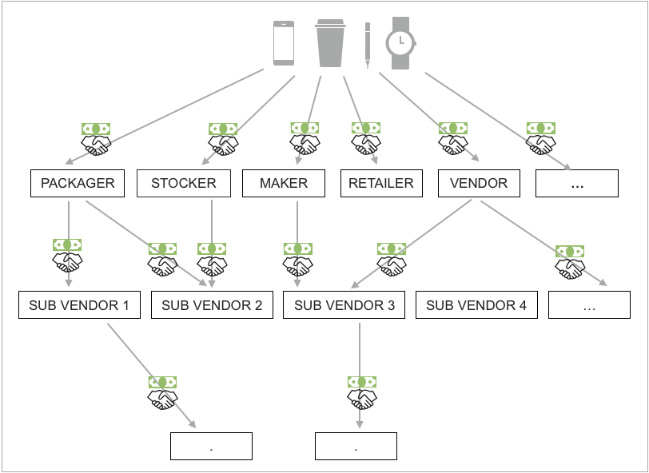
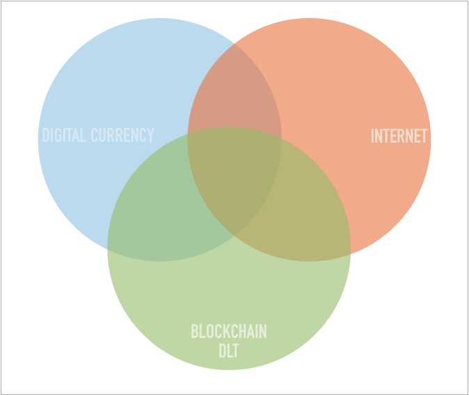
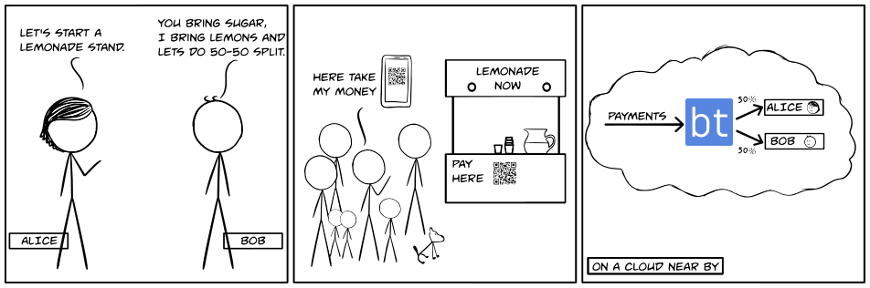
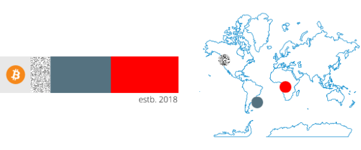

<p align="center">
  
</p>

<h1 align="center">Whitepaper</h1>

<p align="center">
  <a href="https://blockterms.com"><h3>blockterms: Collective Structures for Digital Currency</h3></a>
</p>

Author: Anil Kumar <a href="mailto:yak@fastmail.com">yak@fastmail.com</a>.

<p align="center">
  <a href="https://github.com/blockterms/whitepaper/releases">
    
  </a>
</p>

## Contents

- [Terminology](#terminology)
    - [Digital Assets](#digital-assets)
    - [Blockchain](#blockchain)
    - [Distributed Ledger Technology](#distributed-ledger-technology)
- [Introduction](#introduction)
- [Background](#background)
- [Problem Space](#problem-space)
- [Solution](#solution)
- [How does it work?](#how-does-it-work?)
- [blockterms Partnership](#blockterms-partnership)
    - [Common types of Partnerships](#common-types-of-partnerships)
    - [Partnership Address](#partnership-address)
    - [Ownership Structure](#ownership-structure)
        - [Tokens and Ownership Structure](#tokens-and-ownership-structure)
    - [Settlement Algorithm](#settlement-algorithm)
    - [Transaction Attributes](#transaction-attributes)
    - [Ownership of Partnership Address](#ownership-of-partnership-address)
    - [Settlement Frequency](#settlement-frequency)
    - [Accrual of smaller amounts](#accrual-of-smaller-amounts)
- [Ownership Transparency](#ownership-transparency)
- [Partnership Economy](#partnership-economy)
- [Real world Use cases](#real-world-use-cases)
    - [Online bookings](#online-bookings)
    - [Real estate](#real-estate)
    - [Home loans and Savings Accounts](#home-loans-and-savings-accounts)
    - [Content Creators](#content-creators)
    - [Infrastructure](#infrastructure)
    - [Education](#education)
    - [Modern technology services](#modern-technology-services)
    - [Dividends for ICOs](#dividends-for-icos)
- [Final Note](#final-note)
- [References](#references)

## Terminology

#### Digital Assets

"Digital Assets" are also called "crypto coins", "crypto tokens", "crypto currency," "virtual currency", or "digital currency". Most of these assets are based on cryptographic protocol of a computer network that may be centralized or decentralized and closed or open-source.

In this paper, Digital assets represent assets that are used as a medium of exchange and/or a store of value.

Popular examples of digital assets are bitcoin, ether, miota, neo and ripple among many others. As of 2018, there are over 1300 known crypto currencies. All of the assets issued by these currencies are considered Digital assets.

Concepts used in this whitepaper can easily be applied to nation state currencies like dollar, yuan or yen when used in the context of online payments. The transaction fees and the regulation around handling traditional currencies might be prohibitively expensive.

>https://en.wikipedia.org/wiki/List_of_cryptocurrencies

#### Blockchain

From [wikipedia](https://en.wikipedia.org/wiki/Blockchain).

A blockchain is a continuously growing list of records, called blocks, which are linked and secured using cryptography. Each block typically contains a cryptographic hash of the previous block, a timestamp and transaction data. By design, a blockchain is inherently resistant to modification of the data. It is "an open, distributed ledger that can record transactions between two parties efficiently and in a verifiable and permanent way". For use as a distributed ledger, a blockchain is typically managed by a peer-to-peer network collectively adhering to a protocol for validating new blocks. Once recorded, the data in any given block cannot be altered retroactively without the alteration of all subsequent blocks, which requires collusion of the network majority.

blockchains are secure by design.

#### Distributed Ledger Technology

Distributed Ledger Technology or (DLT) is a digital system for recording transaction of assets. Details of these transactions are recorded in geographically distributed multiple locations at the same time. Distributed ledgers do not have a central data store or a central authority that controls the contents of the data store. blockchain is one implementation of Distributed ledger technology.


## Introduction

**blockterms: Collective Structures for Digital Currency**

With blockterms, multiple parties can form a digital currency payment address and define an ownership structure for how to settle funds in that address and how often. Consumers pay at the payment address in exchange for goods and services and all the parties involved in the ownership structure get their appropriate share of value in transaction or transactions.

To provide an example from gig economy, a community ride sharing app "AirLift" and individual driver can be partners on blockchain or distributed ledger via blockterms. These two partners can agree upon their ownership structure in a transaction depending on the most common implementable terms defined as follows.
	
1. Driver gets 70% and AirLift gets 30% of the consumer payment transaction.	
2. If it is late at night, driver should be rewarded 10% more.	
3. If the driver has a good reputation, AirLift wants to reward the driver with an extra flat fee per ride up to 1000$ per month.
	
As you can see, the terms could be very simple and could get very complex.

There are two important parts in the above partnership example.

1. Ownership structure.  
2. Settlement Algorithm. 

Ownership structure determines the participants and their share of value in incoming transactions  depending on agreed terms and conditions. Ownership structures can be public or private and stored privately or on public/private distributed ledger. 

Settlement Algorithm executes the terms and ensures the partners get their share of the partnership. 
Settlement algorithms can be open sourced or closed.

In summary, blockterms is a trust-less settlement layer on top of digital cryptographic currencies like bitcoin.

## Background



**Fig.1**

Different entities form collaborative financial relationships with each other to bring a product or service to market. This model of organizing our commerce produced some of the greatest inventions which we use in our daily lives.

To understand the scale of this co-operation and it's effectiveness, please watch this video from a renowned economist who describes how this voluntary permission-less cooperation brought prosperity to so many people across the world.

Longer version [Prof Milton Friedman - Lesson of the Pencil](https://www.youtube.com/watch?v=4ERbC7JyCfU)

Shorter version [Prof Milton Friedman - Lesson of the Pencil](https://www.youtube.com/watch?v=67tHtpac5ws)

Text Reference [I, Pencil: My Family Tree as told to Leonard E. Read]

In this model of trade and commerce, an individual can accumulate wealth only by adding meaningful value to others. Recently more and more people feel left out of this system of prosperity. This feeling may be temporary and is probably a direct effect of financial crisis of 2008.

Moving forward, if this model of organizing human activity for productive purposes were to continue to work well, it should include an element of transparency and fairness perception into it.

A model of co-operation in finance should not only be fair but at a biological level, people should perceive it's fairness.

Here is a reference to idea of fairness at a biological level

Longer version [Dr Frans de Waal - Moral behavior in animals](https://www.ted.com/talks/frans_de_waal_do_animals_have_morals)

Shorter version [Dr Frans de Waal - Moral behavior in animals](https://www.youtube.com/watch?v=meiU6TxysCg)

Text Reference [Monkeys reject unequal pay]

## Problem Space

Co-operation at this scale across geographical boundaries is challenging in so many ways. 

When consumers pay for a product or service, they do not know where their money eventually goes to. Information about who owns this product, how this product came to be and how much of consumer payment goes to whom etc., is not tied to price or sale of the product. Easy availability of such information to consumers is important to encourage universal moral standards for entities making financial arrangements.

Perception of fairness drives consumer behavior. When people hear about bad working conditions in remote war torn countries or child labor in developing countries, it pushes them to choose alternative options that match their sense of fairness. Some examples are regulations around blood diamonds, poor working conditions in garment factories and ethical sourcing of food. 

In the complete tree of cooperation for a product or service as shown in Fig 1, there are too many financial intermediaries to facilitate this scale of co-operation. Financial intermediaries provide useful services to nurture the financial arrangement but transaction fees for value transfer is so high that it impacts the price of product in marketplace. 

Settlement is not timely. Cash flows from one entity to other entity after accounting for sales is complete at one end. This leaves certain entities in asymmetric financial relationships that are prone to moral hazard. This is a hurdle to forming easy financial relations with entities that a trustless settlement system like blockterms is trying to address.

## Solution



In this paper, I will present how blockterms combines three universal technologies and creates a network of value that brings a new level of transparency to the existing model of commerce.

Three universal technologies are
1. Universal way of communication i.e internet
2. Universal measure of value i.e a digital currency
3. Universal computer i.e a blockchain

blockterms proposes three features.
1. blockterms Partnership with ownership structure
2. Trustless settlement
3. Ownership transparency.

blockterms Partnership is a financial arrangement among multiple entities with well defined share of how much each partner gets from the value of a transaction.

Trustless settlement is an automated way of splitting the value inside a financial transaction among its partners.

Ownership transparency is provided by having a unique web page for a partnership and linking partnership addresses in the ownership structure with other partnerships and its information across web pages on internet.

## How does it work?

It works in 3 steps
1. Pick a currency, pick a blockchain and set ownership share of values of each partner in every transaction. This creates a unique digital asset address with a unique webpage for this partnership.
2. Integrate this payment address in product or service and your payment service provider and accept payments.
3. blockterms accrues tiny amounts of values for every partner in the partnership address ownership structure and settles funds among all the partners.

## blockterms Partnership

blockterms Partnership is a financial arrangement based on transactions and ownership structure. Ownership structure is defined per transaction. 

Two implementable goals of blockterms partnership are

1. The concept should be so easy to create and manage using a smart phone. This model can be explained to a high school student team with a sample concept of lemonade business.

2. The settlement of funds among partners should be automated.



## Common types of Partnerships

#### Flat Fees Partnership per transaction  

A flat fees is paid to the partner per transaction. If the value in the transaction is greater than the flat fees, the flat fees is ignored.

|Parameter|Description|
|:----|:----|
|fees|A flat fees is paid to the partner per transaction.|
  

#### Flat Fees Partnership per transaction with limits

  A flat fee is paid to the partner per transaction with a maximum upper limit set per day or per week or per month etc or a overall upper limit.
  
|Parameter|Description|
|:----|:----|
|fees|A flat fees is paid to the partner per transaction.|
|timely_limit|Depends on timely_frequency. If the total flat fee paid to this partner reaches this limit during the time_frequency duration. The flat fee will not be paid for the remainder of the timely_frequency duration.|
|timely_frequency|daily, weekly, monthly, every N days|
|max_upper_limit|This is the total maximum amount that will ever be transferred to this partner. After that point the partnership ends.|
  
#### Percentage Partnership per transaction
   
   A percentage of the transaction amount will be paid to the partner. Sum of all percentages should add up to 100%
  
|Parameter|Description|
|:----|:----|
|percentage|A percentage of the transaction amount will be paid to the partner.|


#### Percentage Partnership per transaction with limits

A percentage of transaction is paid to the partner per transaction with a maximum upper limit set per day or per week or per month etc.


|Parameter|Description|
|:----|:----|
|percentage|A percentage of the transaction amount will be paid to the partner.|
|timely_limit|Depends on timely_frequency. If the total amount paid to this partner reaches this limit during the time_frequency duration.  No more amount will be transferred for the remainder of the timely_frequency duration.|
|timely_frequency|daily, weekly, monthly, every N days|
|max_upper_limit|This is the total maximum amount that will ever be transferred to this partner. After that point the partnership ends.|

Once this percentage partnership ends, proportional increase for other percentage partners or this funds get collected to specific addresses.

#### Time Varying Flat Fees Partnership

  In a Time varying flat fees partnership, the fees increases or decreases depending on a simple/compound interest rate. This partnership can have timely limits or overall limit. 
  Timely limits stop after reaching an upper limit during a time period where as the partnership ends when the over all limit is reached. 

   This kind of partnership is a good candidate to raise investment or funding for short term projects.

#### Time Varying Percentage Partnership

  Similar to above. Instead of flat fees, partner gets a percentage of transaction.

#### Runtime partnerships

  Runtime Partnerships depend on runtime information available in every transaction in transaction attributes. Settlement algorithms parse the transaction attributes to make dynamic decision on the ownership share of each partner.

#### Complex Partnerships

   Complex partnerships depend on external data like performance of partners for the duration of settlement.


### Partnership Address

Partnership addresses are generated for a given currency. A visual representation for a public partnership address can be obtained going to url 

> https://blockterms.com/partnership/[address].svg?size="small|medium|large"


The visual representation of a sample address with both flat fees and percentage partnership looks as follows.


  

bitcoin is the currency of exchange for this partnership. The dotted area indicates flat fees and each color represents different partner and their percentage ownership. estb 2018 indicates this partnership was established on blockchain since the year 2018

This image visual can be linked to from different marketing material for the product or service offered at this partnership address.
 
 A public partnership address has its own unique web page address where information about the financial arrangement and its version history are available. If the partnership has relationships with other partnership addresses, those are shown as links to their own web pages thus representing a network of value. The whole partnership structure can be visualized as a graph with nodes and edges. nodes represent partnership addresses and edges represent financial relationship between the nodes.

### Ownership Structure

Ownership structure of a partnership could range from simple to complex. For public partnerships, this information is stored on public blockchain. Current reference implementation uses NEO.

Data Stored on blockchain for simple partnerships

```
1. Address where the payment is accepted
2. Currency of the Contract
3. FlatFeestructure addr:val,addr:val......
4. PartnershipStructure addr:val,addr:val......
5. LocationStructure addr:location,addr:location....
6. A Website Address where users can find more information
```

The format of the data could be slightly different depending on the underlying blockchain capabilities. The data should be serializable to json or xml very easily. Consistency and standardization of this format is very important to make blockterms information on the blockchain interoperable with other emerging systems in distributed ledger technology space.

For slightly more complex ownership structures, the data structure would also involve conditional statements as parameters.

For dynamic runtime partnerships, a python function can generate the ownership structure at runtime.

#### Tokens and Ownership Structure

For a network or system with utility tokens, You can derive ownership structure automatically from the share of tokens each address owns. With blockterms you can create one partnership address with this ownership structure and distribute dividends for all the owners.

### Settlement Algorithm

Every partnership address pairs with a settlement algorithm which executes the terms of the partnership.
It should be possible to standardize settlement algorithms for most common use cases and allow advanced users to define specific algorithms for special cases.
 
Settlement algorithms could be open source or private, simple or complex.

Settlement is a zero sum activity. All the incoming funds have 100% destination.

Simpler settlement systems depend on fewer parameters, and the amount of data the settlement system depends on determines its complexity.

Some examples of simpler systems are.

* A book author partners with a website/mobile app to sell their new book at a flat fee based partnership. 
This also applies to other kinds of products promoted on websites/television media like games, apps, movies, manufactured products.
* A small investor can partner with an artist/craftsman to upfront some investment in exchange for a time limited percentage partnership on sales of the creative work.
* A partnership of a small team with cross sectional skills. e.g., a group of skilled professionals could agree on a percentage terms for a small project they do together like a documentary crew or a volunteer medical team or short term advertising campaigners etc.
	
In all these cases, the terms of partnership are relatively simple and depend on fewer parameters. If there are funds in the partnership address, the account will be settled according to the pre determined terms. 

In some other cases, runtime parameters are sent as part of the transaction using extra information in the transaction via transaction attributes. The extra information could be simple name value pairs like cookies or http parameters.  

In certain complex use cases of real world scenarios, instead of moving the data near a settlement algorithm, it would be lot easier to move the settlement algorithm near the data.

Some examples of such complex systems are

* How to fairly distribute funds among members of a winning football team?. 
* How to fairly distribute funds among contributing members of an open source software/hardware/design project?
* How to fairly distribute funds among a support team based on number of tickets closed?
* How to fairly distribute funds among a social network community members based on their reach for a messaging campaign?

In all the above cases, it might be hard to come to an agreement on what is fair. The amount of data collected and the importance of data to the context of the settlement determines the complexity and feasibility of an implementable settlement system.


### Transaction Attributes

Transaction Attributes can be sent along with a payment transaction. This extra information is used by settlement algorithms to execute the terms of partnership which need context data to make decisions.

Transaction Attributes will be part of the blockchian or distributed ledger. Clients that do not want this information public can send encrypted transaction attributes using shared keys.

ECDH allows two parties, each with their own private and public key pair can generate a common shared key to be able to send and receive encrypted messages.

The payment sender makes an api call by passing a public key to a partnership address end point and get a shared key. Messages sent with this shared key between two parties can be decrypted only by these two parties.

>https://en.wikipedia.org/wiki/Elliptic-curve_Diffie%E2%80%93Hellman

### Settlement Frequency

The minimum is block level. Everytime a new block is created for the currency, that block is inspected for partnership addresses and the transactions are settled.

At the other end is manual. The funds accumulate until someone with valid edittoken for the partnership manually calls for settlement of funds. This option is very helpful to preview the settlement before actually transferring funds.

In currencies that do not have blocks it may be possible to have a transaction level settlement.

### Accrual of smaller amounts

After every settlement, if the share of a partner is below a very small threshold value, these amounts are accrued in the partnership address and transfer of the funds are withheld until their sum adds up to a value above the threshold value. This is also true for settlement fees. 

We batch many small amounts into one transaction. The threshold value is different for different currencies

## Ownership transparency

Consumers can browse through the partnership structures for the product or service they purchased and see where their money goes and how the product came to be. 



## Partnership Economy

Blockchain is often described as internet of value. Blockterms leverages the potential of blockchain to deliver a digital partnership economy.

A group of individual addresses can form a partnership address and a group of individual addresses and or partnership addresses can form other partnerships thus forming complex chain like and pyramid like structures of cooperation to provide goods and services in marketplace. This is analogous to a group of atoms forming molecules and a group of atoms and or molecules forming other molecules. 

A variety of complex chains and pyramids are possible with payment addresses inside other payment addresses and so on. All of these structures can be linked together using urls to these addresses in webpages.


Pyramid is a bad word to use in finance but these digital sky scrappers allow us to inspect pricing of common goods and services offered in the market place and debug for what components can be improved to reduce prices and make price efficient economic modules.


## Ownership of Partnership Address

An edittoken is generated and created when the partnership address is created. edittoken is optionally linked to email address. If a user forgets the edittoken a link to reset the edittoken is sent to the email address. 

Who ever owns the edittoken, owns the access to edit the partnership. The keys to the partnership address are owned by blockterms. These keys are only used to sign transactions offline and submit to the currency network. 

It may be possible to build a multi signature system where multiple partners have to signoff to make a change in the partnership information. This will eliminate the need for edittokens. Community adoption drives such customized feature needs.

## Real world Use cases

### Online bookings
A hotel owner and an online bookings company can partner with each other via blockterms and can settle funds in near real time when ever consumers pay for the booking.

### Real estate
A small group of investors fund a real estate project and create an ownership structure using blockterms. They get returns back from the project in monthly rents.

### Home loans and Savings Accounts
The current model of home purchase involves going to a trusted centralized authority like bank and seeking a loan payable back in X amount of years at a modest interest rate in form of monthly payments. The bank takes deposits from other savers who save their money in the bank in exchange for a smaller rate of return. In this model, the money from savers is going to the home loans via the middleman i.e the bank. Even though the savers did not directly benefit so much from the economic activity that happened with their money after their savings were deposited in the bank, this model worked well for so long. 

Blockchain allows for improvement in this model. The Home loan from prospective home buyers can be broken down into 10,000 pieces of ownership with each person owning small chunk of the house mortgage loan. Blockterms makes it possible to easily form ownership structures like this. Every month when home owner pays the mortgage, blockterms splits the amount to the ownership structure proportionately. 

This newer modal helps savers derive more value out of their savings.  

### Content Creators

A small team of people with different skills can form a simple percentage partnership on blockterms and start creating value immediately. Whenever their work is used or there is a payment on the partnership address, all the partners get their share of value instantly. 

App makers, game developers, video makers, music makers, music bands, documentary makers, artists, writers, bloggers, animators, 3D modellers and many small teams can benefit from a simpler collaboration model that reduces the complexity of settlement.

### Infrastructure

blockterms opens up a new model of localized finance for infrastructure. 

Raise funds for a road or bridge from local community and create an ownership structure. Build the bridge and then the owners get paid back in micro transaction accruals for every time someone pays for the use of infrastructure.

One other simple use case for this model is a smart parking meter. A smart parking meter would require multiple parties to come-together, e.g. the city, the local community, the company that produces and services the machines and the consumer. Every time a consumer uses this machine, all these partners need to get their share of value. The terms for their partnership need to be adjusted and revised from time to time. blockterms provides the tools necessary to make it happen. Such kind of public-private ownership of community resources is made easy by crypto currencies and blockterms plays a small part in that.
At any given time, a consumer can inspect the entire tree of partners who collaborated together to bring this setup into their community.

### Education

Teachers, schools and universities should be a financial partner in student’s future success. The partnership value should diminish with time and should have appropriate maximum life time limits per student. In this model, the earnings of schools and universities are directly derived from future financial success of their students, this is a great incentive for educational institutions to provide good quality education and bring the best out of every student instead of providing generic same education for everyone. 

The idea of retirement benefits for teachers is a very difficult subject but professions like teaching can also be productive ventures that need to be rewarded just like any other enterprise in the marketplace and the rewards for the effort they put in should be returned to them during their lifetime including during retirement.

The current model of financing for primary education is provided by governments across the world. The rewards for educators in terms of pay and pensions are not based on economic factors of demand and supply and this makes it very difficult to come up with a fair model compensation for these professions.

For higher education, financial institutions let students borrow from their future but the model for what is the fair current cost of education is very difficult to derive mathematically.

blockterms provides a framework for a decentralized financial model where every student has an individual blockterms payment address with ownership structure consisting of all educators and educational institutions relevant to the student. A percentage of future earnings from current student's future paycheck goes into paying for this service offered.

### Modern technology services

Car companies spend a lot of effort in doing R&D to bring consumers the latest and greatest of their innovation. The designers and engineers spend countless hours perfecting their plans and ideas to make it better and safer for people to use the cars they make. And after that, they do a lot of financial engineering to make their invention affordable to wider consumer base. If the consumer buys this modern marvel and goes and robs a bank (figuratively) with a getaway car, the car companies do not get a cut in spoils. What kind of fairness is this?

Car companies could derive more value out of their invention by financially partnering with other enterprises that depend on their cars to conduct their business operations. One example is ride sharing apps.

blockterms creates a finance model for car companies to directly partner with a ride sharing application and drivers to get a cut from every transaction. This model of financing helps the driver get into a productive venture with lesser capital and helps a car company derive more value out of their creation. 

### Dividends for ICOs

ICOs are a new form of raising capital from investors for an agreed amount of ownership. The same ownership structure can be used to distribute returns to investors in form of dividends. blockterms makes it easy to organize and manage an ownership structure and version it with time.

## Final note

Finally a note about a concept called karma, which means action. According to eastern spirituality, the universe does a _high precision floating point arithmetic_ to keep track of every one’s KARMA, both positive and negative until it adds up to a sizable amount and then comes around and manifests into reality in form of life events. 

This is a reason to _bGood_ variable in this world.

This is similar to what blockterms intends to do with financial transactions and the universal computer i.e the blockchain.


## References

* Lesson of the Pencil
    * Longer version [Prof Milton Friedman - Lesson of the Pencil](https://www.youtube.com/watch?v=4ERbC7JyCfU)
    * Shorter version [Prof Milton Friedman - Lesson of the Pencil](https://www.youtube.com/watch?v=67tHtpac5ws)
    * Text Reference [I, Pencil: My Family Tree as told to Leonard E. Read]

* Moral behavior in animals
    * Longer version [Dr Frans de Waal - Moral behavior in animals](https://www.ted.com/talks/frans_de_waal_do_animals_have_morals)
    * Shorter version [Dr Frans de Waal - Moral behavior in animals](https://www.youtube.com/watch?v=meiU6TxysCg)
    * Text Reference [Monkeys reject unequal pay]
    
* Kanye West - Diamonds From Sierra Leone
    * https://genius.com/806432
    * https://www.youtube.com/watch?v=92FCRmggNqQ

* https://en.wikipedia.org/wiki/Elliptic-curve_Diffie%E2%80%93Hellman

* Formalizing and Securing Relationships on Public Networks by Nick Szabo
    * http://firstmonday.org/article/view/548/469

[I, Pencil: My Family Tree as told to Leonard E. Read]: http://www.econlib.org/library/Essays/rdPncl1.html
[Monkeys reject unequal pay]: http://www.emory.edu/LIVING_LINKS/publications/articles/Brosnan_deWaal_2003.pdf
